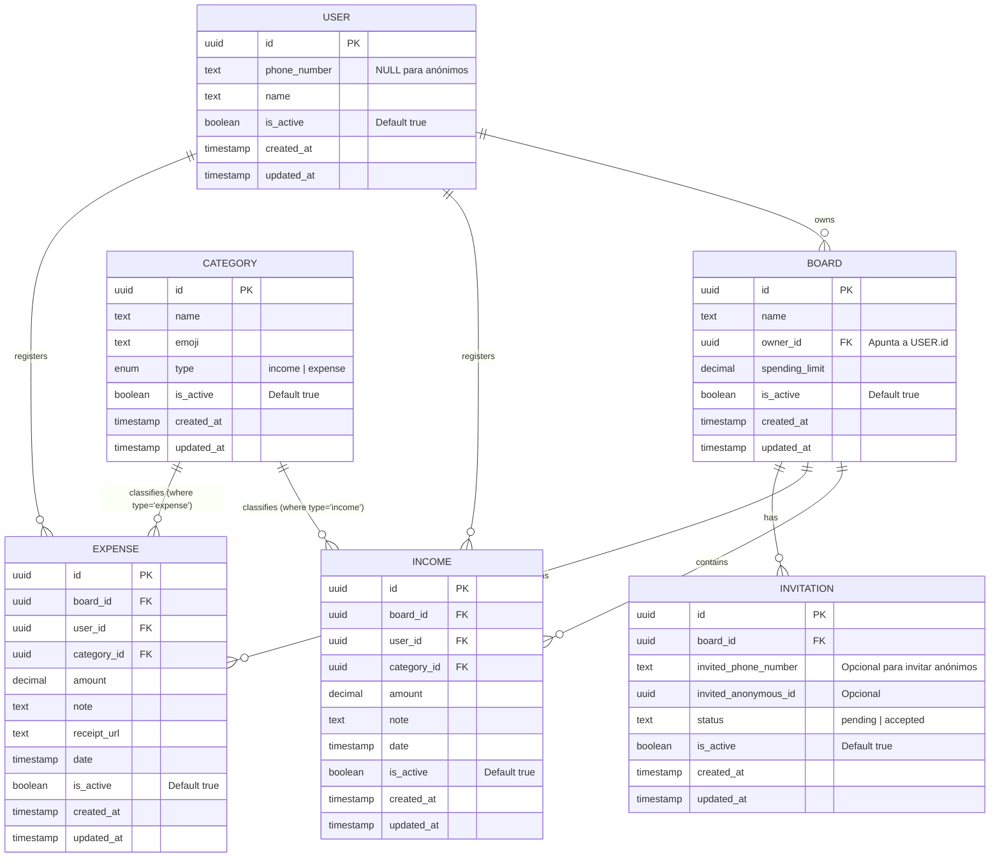
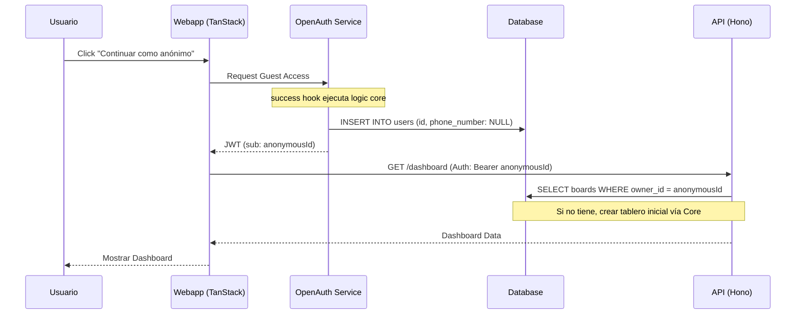
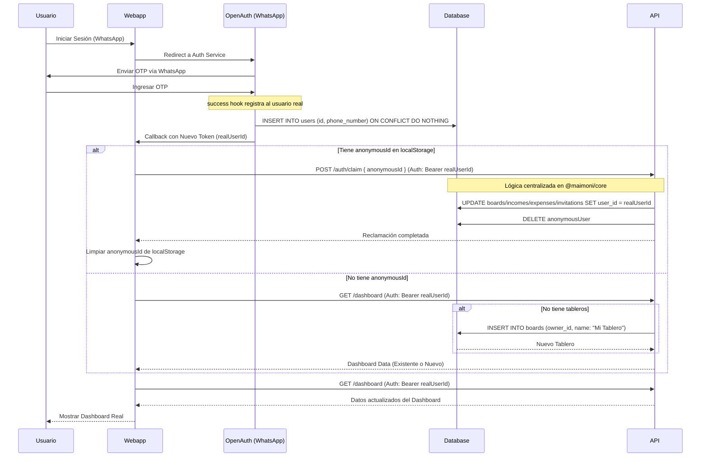

# Plan de Autenticación y Transición de Tableros

Este documento detalla el flujo de autenticación híbrida para Maimonei, permitiendo el uso anónimo inicial y la transición sin fricciones a una cuenta de usuario autenticada.

## 1. Visión General
El objetivo es permitir que los usuarios comiencen a usar la aplicación inmediatamente (modo anónimo) y que puedan "reclamar" sus datos cuando decidan autenticarse mediante WhatsApp.

## 2. Flujo de Usuario

### Escenario A: Usuario Nuevo (Anónimo)
1. El usuario ingresa a la app.
2. Se presenta la opción: "Continuar como anónimo" o "Iniciar sesión".
3. Si elige "Continuar como anónimo":
    - La Webapp solicita un **token anónimo** al servicio de OpenAuth.
    - OpenAuth emite un JWT con un `subject` de tipo `user` pero sin `phoneNumber`.
    - El `userId` (sub) del token se guarda en la sesión/navegador.
    - La Webapp llama al API para registrar el usuario en la base de datos (si no existe) y crear su tablero inicial.
    - El usuario puede añadir gastos normalmente usando este token para autenticar sus peticiones al API.

### Escenario B: Autenticación y Reclamación
1. El usuario decide iniciar sesión (WhatsApp OTP via OpenAuth).
2. Tras una autenticación exitosa:
    - OpenAuth emite un **nuevo token** vinculado al `phoneNumber` y un nuevo `userId` real.
    - La Webapp detecta que tenía una sesión anónima previa (`anonymousId`).
    - La Webapp llama al endpoint `POST /auth/claim` enviando el `anonymousId`.
    - El backend ejecuta el proceso de "reclamación":
        - Los tableros, miembros, ingresos y gastos asociados al `anonymousId` se transfieren al nuevo `userId`.
        - En caso de coincidencia de nombres de tableros, se mantienen ambos para preservar la integridad de los datos.
        - El registro del usuario anónimo se elimina de la DB tras la migración.
        - La sesión anónima se descarta en favor de la autenticada.

## 3. Arquitectura y Base de Datos

### Diagrama de Entidad-Relación (Evolución)



### Cambios en Esquema (`packages/db/src/schema.ts`)
- **Global**: Añadir campos `updated_at` (timestamp) e `is_active` (boolean, default true) a todas las tablas (`users`, `boards`, `incomes`, `expenses`, `categories`, `invitations`, `board_members`).
- **Normalización**: Reemplazar la tabla `movements` por dos tablas específicas: `incomes` y `expenses`.
    - La tabla `expenses` incluirá campos específicos como `receipt_url`.
- **Validación de Categorías**: Las categorías están tipadas mediante el campo `type` (`income` o `expense`). 
    - Un `INCOME` solo puede referenciar una `CATEGORY` de tipo `income`.
    - Un `EXPENSE` solo puede referenciar una `CATEGORY` de tipo `expense`.
- `users.phoneNumber`: Cambiar de `.notNull()` a opcional. La ausencia de este campo define a un usuario como **anónimo**.
- **Migración**: El proceso de "claim" ahora deberá actualizar el `user_id` tanto en la tabla `incomes` como en `expenses`.

## 4. Diagramas de Secuencia

### Flujo de Continuar como Anónimo


### Flujo de Reclamación (Post-Login)


## 5. Organización del Código (Core Logic)

Para asegurar la consistencia y permitir el uso compartido entre `apps/auth` y `apps/api`, la lógica crítica se centralizará en `packages/db` (o un futuro `@maimoni/core`):

### Funciones en `@maimoni/core/auth`:
- `syncUser(id, phoneNumber)`: Lógica para el hook de OpenAuth que asegura la existencia del usuario.
- `claimAnonymousData(realUserId, anonymousId)`: **Función Transaccional** que migra tableros, ingresos, gastos e invitaciones del ID anónimo al real.
    - *Regla*: No se eliminan duplicados por nombre; se preserva todo.
- `getOrCreateInitialBoard(userId)`: Asegura que todo usuario (anónimo o recurrente) tenga al menos un tablero para operar.

### Invitaciones Anónimas:
- Los usuarios anónimos **pueden invitar** a otros usuarios mediante número de teléfono.
- El sistema debe permitir que un tablero sea compartido incluso entre usuarios que aún no han completado su registro oficial.

## 6. Infraestructura Interviniente
- **SST Ion**: Orquesta todos los recursos.
- **OpenAuth (apps/auth)**: Gestiona la emisión de identidades reales y la validación de WhatsApp.
- **Hono API (apps/api)**: Puerta de enlace para la lógica de negocio y migración de datos.
- **Drizzle ORM (packages/db)**: Gestiona las transacciones de base de datos para asegurar que el "claim" no pierda datos.
- **Twilio**: Proveedor de mensajería para el envío del código OTP.

## 7. Estrategia de Pruebas y Verificación (QA)

Para asegurar que la implementación cumple con los requisitos y evitar regresiones, se seguirá una estrategia de pruebas en tres niveles, utilizando **Bun** como test runner principal.

### 7.1. Pruebas Unitarias (Bun Test + Mocking)
*   **Objetivo**: Validar la lógica de negocio pura en `packages/db` o `@maimoni/core`.
*   **Foco**:
    *   Cálculo de balances (ingresos - gastos).
    *   Validación de categorías (un gasto no puede tener categoría de ingreso).
    *   Transformación de datos para el claim.
*   **Herramientas**: `bun test`.

### 7.2. Pruebas de Integración (Bun Test + Testcontainers)
*   **Objetivo**: Validar la interacción real con la base de datos PostgreSQL.
*   **Escenarios Críticos**:
    *   **Transacción de Claim**: Ejecutar `claimAnonymousData` y verificar que todas las tablas (`boards`, `incomes`, `expenses`) se actualicen y que el usuario anónimo sea eliminado físicamente.
    *   **Conflictos de ID**: Intentar reclamar un ID que no existe o que ya tiene un número de teléfono.
    *   **Persistencia en Auth Hook**: Validar que el hook `success` de OpenAuth realmente cree el registro en la DB.
*   **Herramientas**: `bun test`, `testcontainers-node` (PostgreSQL).

### 7.3. Pruebas End-to-End (Playwright)
*   **Objetivo**: Validar el flujo completo desde la perspectiva del usuario.
*   **Flujo "Happy Path"**:
    1.  Entrar como invitado (Verificar creación de `anonymousId`).
    2.  Crear un gasto anónimo.
    3.  Iniciar sesión con WhatsApp (Simular callback de OpenAuth).
    4.  Verificar que el gasto creado anteriormente aparezca en el dashboard del usuario autenticado.
    5.  Verificar que `localStorage` esté limpio.
*   **Herramientas**: `playwright`, `bun test`.

### 7.4. Estructura de Carpetas para Pruebas

Se adoptará un modelo híbrido que combina la co-localización para lógica de bajo nivel con carpetas dedicadas para flujos complejos:

```text
src/
  module/
    logic.ts
    logic.spec.ts          # Tests Unitarios (Co-localized)
    logic.test.ts          # Tests de Integración con DB/Testcontainers
tests/
  e2e/                     # Pruebas End-to-End (Playwright)
    auth-flow.e2e.ts
    claim-flow.e2e.ts
  fixtures/                # Datos de prueba (JSON, etc.)
    mock-users.json
  mocks/                   # Mocks de servicios externos e HTTP
    http/
      mock-auth-service.ts
```

### 7.5. Criterios de Aceptación para la IA (Definition of Done)
1.  **Code Quality**: `bun run check` (Biome) debe pasar sin errores.
2.  **Type Safety**: `tsc --noEmit` debe pasar en todos los paquetes.
3.  **Database Migrations**: 
    - Toda modificación al esquema debe ir acompañada de `drizzle-kit generate` para crear el archivo de migración.
    - Se debe verificar la migración mediante `drizzle-kit migrate` (o el comando equivalente del proyecto) antes de dar la tarea por completada.
4.  **Test Coverage**: Los tests de integración deben cubrir el 100% de la lógica de la función `claimAnonymousData`.
5.  **Audit Ready**: Cada registro creado en las pruebas debe tener sus campos `created_at`, `updated_at` e `is_active` correctamente seteados.
6.  **Standardized Structure**: Los tests deben seguir estrictamente la estructura de carpetas definida en la sección 7.4.

## 9. Precisiones Técnicas para la Implementación (IA Ready)

### 9.1. Configuración de OpenAuth (Proveedores Personalizados)
Dado que los casos de uso son específicos, no se utilizarán los proveedores predefinidos de OpenAuth de forma estándar. Se deben implementar proveedores personalizados en `apps/auth`:
- **AnonymousProvider**: Un proveedor que no requiere credenciales y emite un `subject` con un UUID nuevo. Debe integrarse en el flujo de `success` para registrar al usuario en la DB antes de emitir el JWT.
- **WhatsAppProvider**: Refactorizar el uso de `CodeProvider` para asegurar que el `success` hook maneje correctamente la transición de identidades.

### 9.2. Transacciones con Drizzle ORM
La integridad de los datos es crítica, especialmente durante el proceso de "claim". 
- **Regla de Oro**: Toda operación de reclamación DEBE envolverse en `db.transaction(async (tx) => { ... })`.
- **Implementación**: Las funciones en `packages/db` deben estar diseñadas para aceptar tanto la instancia de base de datos principal como una instancia de transacción de Drizzle para permitir la composición de operaciones.

```typescript
// Ejemplo de firma en packages/db
export const claimAnonymousData = async (
  db: DatabaseInstance | PgTransaction<any, any, any>,
  { realUserId, anonymousId }: { realUserId: string; anonymousId: string }
) => {
  return await db.transaction(async (tx) => {
    // Lógica de migración aquí usando 'tx'
  });
};
```

### 9.3. Manejo de Tokens y SSR (TanStack Start)
- **Cookies**: El `accessToken` y el `anonymousId` deben manejarse vía cookies con atributos `httpOnly` (para el token) y `SameSite=Lax` para asegurar que el SSR en TanStack Start pueda acceder a la sesión durante la carga inicial de las rutas.
- **Middleware**: Implementar un middleware en la API de Hono que valide el JWT de OpenAuth y extraiga el `userId` de forma segura.

### 9.4. Inyección de Dependencias para Testing
- Para que los tests con **Testcontainers** sean efectivos, las funciones del core no deben instanciar su propia conexión a la DB, sino recibirla por parámetro. Esto permite que el runner de pruebas pase una conexión a la base de datos efímera de Docker.

## 10. Próximos Pasos Técnicos
1. Modificar `schema.ts` siguiendo el nuevo diseño (ingresos/gastos separados, auditoría global).
2. Ejecutar `drizzle-kit generate` para crear las migraciones SQL.
3. Ejecutar `drizzle-kit migrate` (o el script de migración del proyecto) para actualizar la base de datos de desarrollo.
4. Implementar la lógica core en `packages/db` para el claim y la creación de tableros.
5. Configurar los proveedores personalizados en `apps/auth`.
6. Implementar el endpoint de claim en `apps/api`.
7. Integrar el flujo en la Webapp con TanStack Start.
